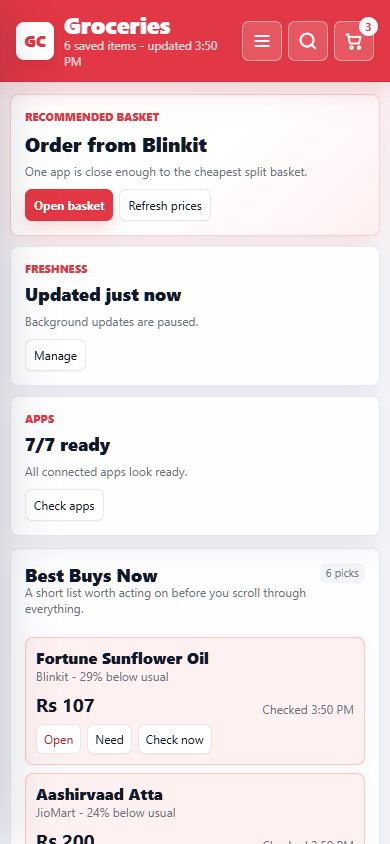

# Grocery Cockpit

Local-first grocery price tracking, unit-price comparison, and deal alerts.

Grocery Cockpit is an early open-source project for people who compare the same grocery basket across multiple stores. It keeps a private local watchlist, normalizes pack sizes, tracks price history, flags suspicious matches, and helps decide whether a split basket is worth the extra ordering friction.

The project started with Indian quick-commerce use cases, but the core ideas are provider-agnostic:

- item watchlists with exact, same-size, category, and unit-price matching modes
- price history with 10-day and 30-day value alerts
- unit price normalization across `g`, `kg`, `ml`, `l`, and pieces
- basket optimization across providers
- a mobile-friendly PWA dashboard
- browser-session based provider probes for personal/local use where official APIs are unavailable
- public-safe demo data for development and screenshots



## Status

This is alpha software. The local dashboard, demo data, matching engine, alerting, and basket logic are usable. Provider probes are experimental and depend on the user configuring their own browser sessions and delivery location.

Grocery Cockpit is not affiliated with Zepto, Blinkit, Swiggy Instamart, Amazon, JioMart, DMart, BigBasket, or any other grocery provider. Use provider adapters responsibly and prefer official APIs when available.

## Quick Start

Install Python 3.13 and Node.js, then:

```powershell
cd "C:\path\to\grocery-cockpit"
npm install
Copy-Item config.example.json config.json
py -3.13 grocery_cockpit.py seed
py -3.13 grocery_cockpit.py serve --host 127.0.0.1
```

Open the private local URL printed by the app:

```text
http://127.0.0.1:8877/?key=YOUR_PRIVATE_KEY
```

On Windows, the helper script starts the dashboard and prints laptop/phone URLs:

```powershell
.\start_grocery_cockpit.ps1
```

Check status:

```powershell
.\status_grocery_cockpit.ps1
```

Stop the dashboard:

```powershell
.\stop_grocery_cockpit.ps1
```

## Demo Data

Run this once on a new database:

```powershell
py -3.13 grocery_cockpit.py seed
```

The seed command creates a small sample grocery list and price history. It does not need your account, address, browser profile, or private grocery history.

## Watchlist Import/Export

Export only saved grocery definitions:

```powershell
py -3.13 grocery_cockpit.py export-watchlist --file watchlist.json
```

Import into another local install:

```powershell
py -3.13 grocery_cockpit.py import-watchlist --file watchlist.json
```

Use `--replace` only when you want the imported file to become the active saved-item list.

Watchlist exports include item names, brands, pack sizes, categories, target prices, notes, and matching rules. They do not include price history, alerts, baskets, provider sessions, location, dashboard access keys, or browser data.

## Configuration

Copy `config.example.json` to `config.json`, then set your own location and access settings.

`config.json` is intentionally ignored by Git. It may contain:

- your delivery area or pincode
- a private dashboard access key
- provider configuration

Do not commit `config.json`, `data/`, browser profiles, logs, screenshots, or exported order history.

## Provider Probes

The browser scanner reads the latest scan plan and can probe provider pages from a dedicated browser profile.

Create a plan:

```powershell
node .\browser_scan_worker.mjs plan
```

Open a provider setup browser:

```powershell
.\setup_provider_browser.ps1 -Provider zepto -Minutes 30
```

Run a small probe:

```powershell
.\probe_provider.ps1 -Provider zepto -Limit 3
```

Provider support is intentionally isolated from the core matching and pricing logic. A public deployment should not include personal browser profiles or cookies.

See [docs/PROVIDER_ADAPTERS.md](docs/PROVIDER_ADAPTERS.md) for the adapter contract and test boundaries.

## Project Layout

```text
grocery_cockpit.py          dashboard, API, storage, matching, alerts
provider_adapters.py        Python provider catalog, routing, and scan policy
browser_scan_worker.mjs     Playwright-based provider probe worker
browser_provider_adapters.mjs browser probe policy registry
auto_scan_worker.py         rotating background scan runner
basket_scan_worker.py       focused basket/item scan runner
static/                     app icons
deploy/                     self-hosting starters
tests/                      core logic tests
docs/                       project notes and maintenance docs
```

## Testing

Run the current test suite:

```powershell
py -3.13 -m unittest discover -s tests
node tests/browser_provider_adapters.test.mjs
node --check browser_scan_worker.mjs
py -3.13 -m py_compile grocery_cockpit.py provider_adapters.py auto_scan_worker.py basket_scan_worker.py
```

The bad-match tests are fixture-driven. Add synthetic cases to `tests/fixtures/bad_match_cases.json` when improving grocery matching behavior.

The decision-engine tests in `tests/test_decision_engine.py` protect basket recommendations and deal-alert thresholds without launching provider browsers.

## Roadmap

- expand import/export for watchlists without personal price history
- add a public demo screenshot set generated from seed data
- improve hosted deployment paths for private self-hosted use

See [ROADMAP.md](ROADMAP.md) for the maintainer-oriented plan.

See [docs/PUBLISHING.md](docs/PUBLISHING.md) for the public release checklist.

## Contributing

Contributions are welcome, especially around:

- price normalization and pack parsing
- matching confidence and false-positive rejection
- demo data and documentation
- provider adapter abstractions
- accessibility and mobile UI polish

Read [CONTRIBUTING.md](CONTRIBUTING.md) and [SECURITY.md](SECURITY.md) before opening issues or pull requests.

## License

MIT. See [LICENSE](LICENSE).
